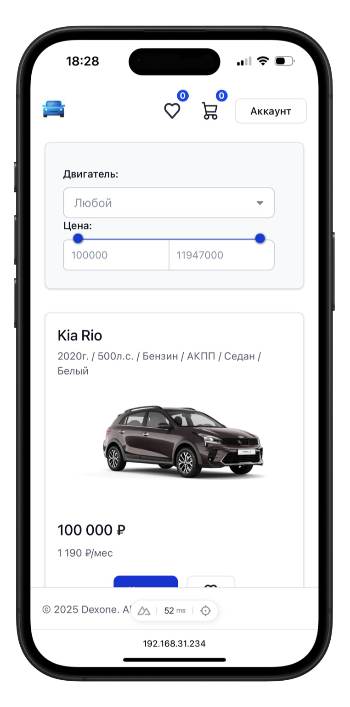

 <!-- 

  

  -->

 <!-- 

  

  -->

 

  

  

 

  <i>Веб-приложение <a href="https://calorielly.ru">calorielly.ru</a> </i>

<h1 align="center">Calorielly</h1>

Счетчик калорий, дневник питания.

  
  

## ✨ Особенности

 - Calorielly — классный, удобный, отзывчивый и легко настраиваемый счетчик калорий
 - Поддерживает авторизацию и создание аккаунта для новых пользователей
 - Имеет гибкие настройки, планирование целей, калькулятор граммов
 - Встроен график изменения веса и таймлайн дневника питания

## 🚀 Использование

Доступно по [этому адресу](https://calorielly.ru).

## ❓ Что это за штука?

Это приложение — песочница, которую я сделал для использования Vue3 и Vite, наряду с интересными пакетами. Оно включает в себя множество различных вещей, таких как:
- Vue 3 c `script setup` синтаксисом.
- Vite с плагинами (`layouts`, `pages`, `components` ...
- Хранит состояния в Pinia.
- Строит графики при помощи Chart.js.
- Имеет резиновую верстку.
- Взаимодействует с бекендом на linux server при помощи axios.

## 🤝 Вклад

Любой вклад в проект приветствуется.
Возникла проблема? Откройте [issue](https://github.com/Dexone/Calorielly/issues/new/choose).  
Хотите добавить какую-то функцию? PR приветствуются!

## 👤 Об авторе

Не стесняйтесь обращаться ко мне:

<!-- ## 📸 Скриншоты

 

 

    

 -->

 ## 📝 Licence

Copyright © 2025 [Dima Martynov](https://github.com/dexone). 
Этот проект находится под лицензией [MIT](https://github.com/Dexone/Calorielly/blob/main/LICENSE). 
_Использованные изображения принадлежат [icons8](https://icons8.ru/)._ 
